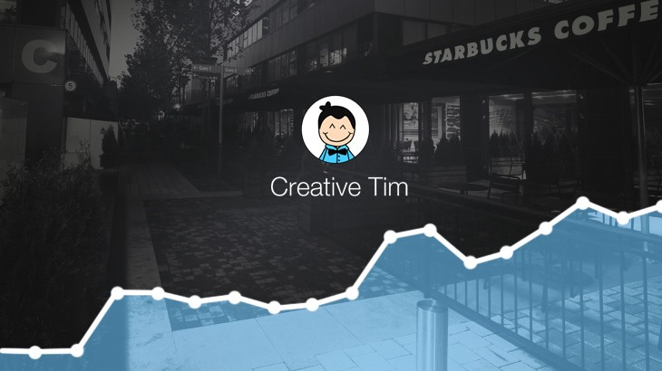
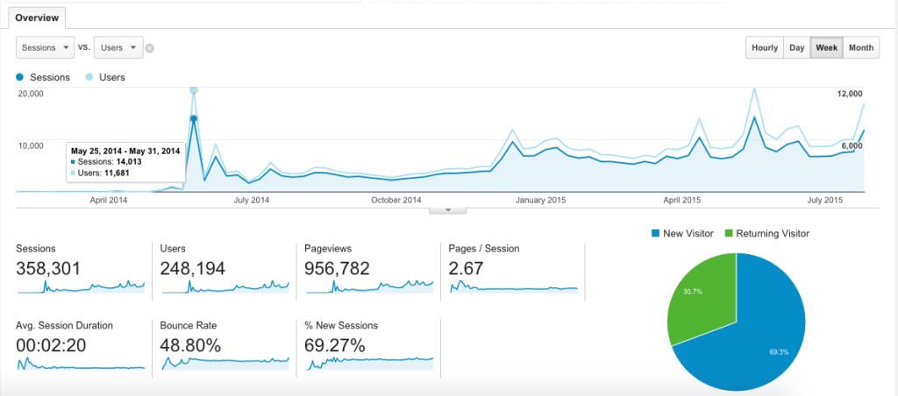
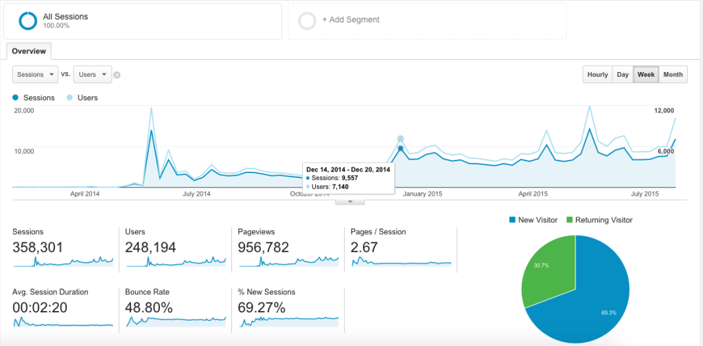
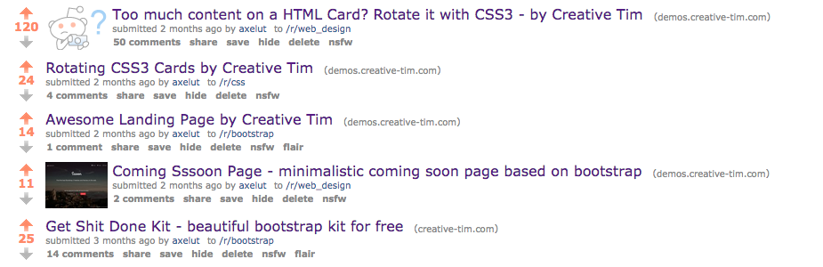
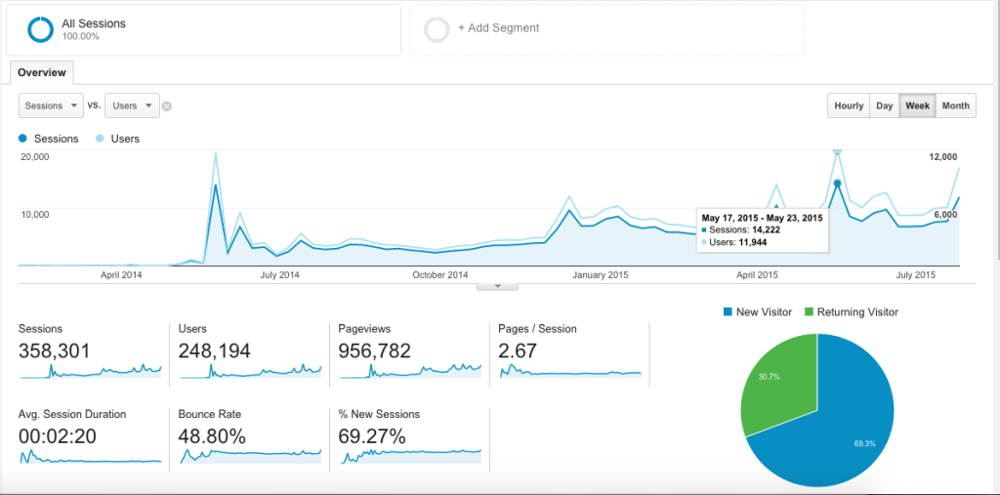
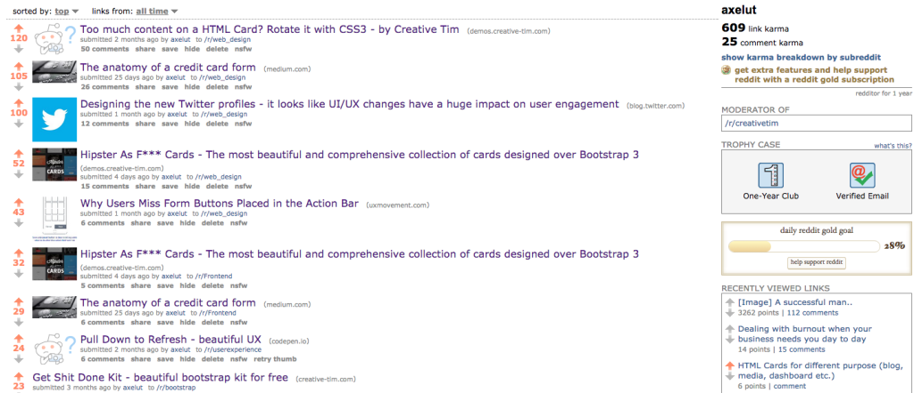
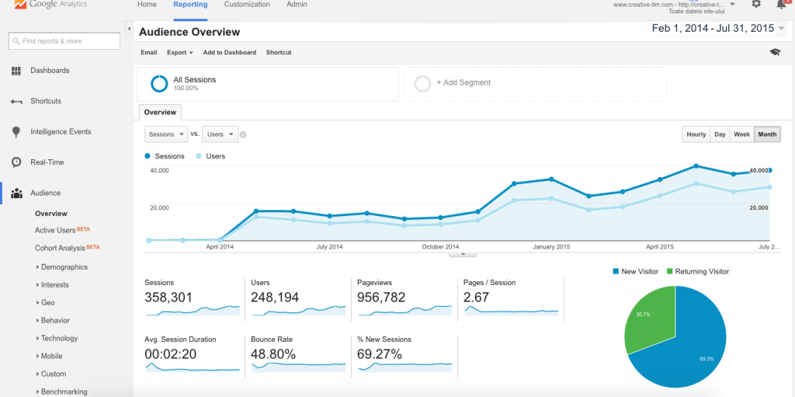

I’m Alex and I began working on a Startup ([Creative-Tim](http://creative-tim.com/)) in partnership with one of my colleagues in a Starbucks in Romania. We didn’t have any cash to rent an office or to stay in a Hub so we had to work for different clients in order to make some money to pay for our daily expenses.

We started by giving freebies ([Datepickers](http://www.creative-tim.com/product/datepicker), [Navbars](http://www.creative-tim.com/product/navbar-with-icons), [Login/Register modals](http://www.creative-tim.com/product/login-and-register-modal)) that help companies and individuals speed up their web development. In the beginning, because we did not have any Twitter Followers, Facebook Fans or Subscribers we were posting a lot of stuff about our freebies on different design forums. Nobody really understood what we wanted to do or what is the value that we can provide in order to improve their business. It was very hard, so we thought that it would be better to create a more complex product that will make people understand what we were doing, so we launched [Get Shit Done Kit](http://www.creative-tim.com/get-shit-done), an UI Kit based on Bootstrap 3. It appeared on [Designer News](https://www.designernews.co)and it was very popular for that period of time ([post here](https://www.designernews.co/stories/24249-get-shit-done-bootstrap3-ui-kit)). We’ve got over 11.000 users coming from that source. That was a huge spike for our business. Then in 2 weeks we appeared on [Product Hunt](http://www.producthunt.com/tech/creative-tim). That gave us another spike with over 5.000 users. Then the situation was stable, we switched from 0 users/week to 2–3.000 constant users/week.

During the Summer of 2014 we released some more freebies ([Rotating CSS Card](http://www.creative-tim.com/product/rotating-css-card), [Coming Sssoon Page](http://www.creative-tim.com/product/coming-sssoon-page), [Bootstrap Wizard](http://www.creative-tim.com/product/bootstrap-wizard)) and in October, because of the success of Get Shit Done Kit Free, we released [Get Shit Done Kit PRO](http://gsdk.creative-tim.com). There were few sales on this Kit, it was generating ~200$/week, not enough to sustain a business. At the same time we were working on a project for one of our big clients. Then in December we appeared on [Bootstrap Expo](http://expo.getbootstrap.com/), the most important gallery that is showing websites created with Bootstrap. This was another important spike for our business because all the people, who are going on Boostrap Expo for inspiration, already know or had worked with Bootstrap, so these guys were the perfect audience for our business:

The months of December and January were very profitable for us, with the PRO Kit’s sales generating about $7.000. Since in Romania the Monthly Average Wage is (400$) and an office rent for 6–7 guys is about 300$/month we could afford to get an office and 2 new guys for the next 6 months.

We released some more freebies then we made another product that we charged for: [Rubik — Presentation Page](http://demos.creative-tim.com/rubik). The sales were the same as of the kit that we began with (3–4 sales/week). We paid to submit it on different famous websites like [Awwwards](http://www.awwwards.com/best-websites/rubik-by-creative-tim), [CSS Design Awards](http://www.cssdesignawards.com/sites/rubik/26463/). It generated some traffic to our website but nothing special regarding sales. We didn’t submit it on Reddit because we didn’t know about it back then and from what we knew it was for promotional purpose and this is not allowed in some subreddits.

Then in April 2015 we thought that it would be the right time to appear in various newsletters to gain more attention from new people. We paid between 100–200$ for a newsletter, 3–4 times. The campaigns were not so good and the ROI matched the amount that we invested (I will not add the name of the newsletters/websites because I don’t want to make a bad image for them, maybe it was our case that was not profitable, maybe for other persons those newsletters are profitable). Then we paid $400 to appear with Get Shit Done Kit PRO in [Sidebar.io](http://www.sidebar.io/sponsor) newsletter, a curated list of 5 best design links made by[Sacha Greif](https://twitter.com/SachaGreif). This was a very rewarding newsletter for us, having generated about $1.500 in sales. Then we purchased the “Review + Newsletter” package($550) from [eWebDesign](http://ewebdesign.com/giveaway-quality-bootstrap-components/). There were about 5.000 users who participated in the giveaway and the total sales amounted $2.800.

After all this time we discovered Reddit, and some important subreddits that are from our area of work ([/r/web\_design](https://www.reddit.com/r/web_design/), [/r/html5](https://www.reddit.com/r/html5/), [/r/frontend](https://www.reddit.com/r/Frontend/), [/r/webdev](https://www.reddit.com/r/webdev/)etc.) and we started to post some freebies there, that we consider being important for different websites. They were highly appreciated in those subreddits:

That also gave us a huge spike, redirecting about 12.000 users to our website:

After that we started to post in these subreddits articles and freebies that are helpful but are not made by us, just to help the community.

It’s important to know that if you have more than 50 upvotes, for example in /r/web\_design, you will get about 6.000–7.000 visitors to your website.

Then we were thinking of different places where we can find web developers which could use our products and we realized that the Hackathons are exactly what we need. So we started to talk to people that are organizing Hackathons, to offer them free licenses for our “premium products”. We sponsored 20 Hackathons from different cities around the world, you can check them [here](http://www.creative-tim.com/sponsorships). All the developers were happy to get free licenses, which made us happy that we could help them create faster/better projects during the 48h Hackathon and they also found out who we are, so win-win.

We have 35.000 users and ~47.000 downloads on all the products that were made by us for our startup. We want to go the next level and create a bigger community where people can collaborate to create beautiful items that will help web developers speed up their work. So at this moment we talk with web designer and web developers and convince them to join our community and share their work and also collaborate in different products. This is also a call for all the web designers and developers that would like to join us. Since our current monthly revenue can sustain our office rent and our salaries (4 persons) we stopped working for clients and we moved full time on our startup.

I know the numbers that I have mentioned in this article are not WOW and we are not a Startup with a viral growth, but at least we started with 0$, no investment, nothing. These numbers are numbers that were generated in one year, while we were also working for a different client and all the products were made by us. We are moving slowly but the figures show that we are going in the right direction:

This is our story, maybe you can apply the points that we learned in 1 year more effectively. I would be happy to know that somebody used this information and got better numbers in a shorter period of time. We had to go through it and test/measure/learn/repeat. The main idea is that you have to find your subreddits, websites, newsletters and people that are from your field of work and then try to contribute to those places. I think this is applicable for any type of business, not only for a web design startup.

I hope this will inspire you to start your own side business and create something that you really love, then to slowly move to working on that business on a full time basis. If you have any ideas, suggestions, feedback, critique — we are open for everything, we were guided by the users’ feedback in everything we did. Or if you started from 0 and did something useful for people, just share it with us.

Here is the [Official Startup Website](http://www.creative-tim.com/?ref=blogss), where you can find all the products that we offer on Creative-Tim. This will be also the main page for the community that we’ve talked about.

P.S. Here are some books (probably everybody has already talked about them) that I read and I think that they will make you change the way you interact with people and the way you act in a Startup.

\* How to win friends and influence people — Dale Carnegie  
\* Zero to One — Peter Thiel  
\* The Hard Thing About Hard Things — Ben Horowitz  
\* Law of Success — Napoleon Hill  
\* Think and Grow Rich — Napoleon Hill  
\* Good to Great — Jim Collins  
\* The Lean Startup — Eric Ries

Update August 2016: We just posted the Part 2 of this blog, new upgrades for the platform, new products, new team members and future plans -> [How we started with $0 in Starbucks and created our Startup — Part 2](http://blog.creative-tim.com/web-design/started-0-starbucks-created-startup-part-2/)
