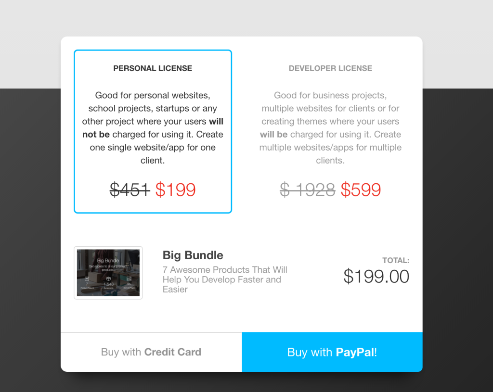

Here is Alex, the co-founder of [Creative-Tim.com](http://Creative-Tim.com). One year ago I’ve decided that we should share our story with the people who are using our products. We also wanted to motivate people to start their own business by doing what they love so we wrote [How we started with 0$ in a Starbucks and Created our Startup.](http://blog.creative-tim.com/creative-tim/started-0-starbucks-created-startup/) I recommend you to read that too in order to get an overview of the full story.

Now it’s that time of the year again, when we want to share the progress with you:

-   What upgrades the platform got
-   Our journey in developing new products
-   What was **Creative Tim** doing in real life
-   Numbers and Vanity Metrics
-   What are our future plans and goals
-   How the team grew

#### What upgrades the platform got

After the previous blog post, even if the numbers (visits/downloads) showed that we are doing well, the revenue was dropping to a level that couldn’t sustain us. We learnt later that visits/downloads are [Vanity metrics.](http://www.startupdefinition.com/vanity-metrics) So August, September and October were the months that saw us trying to improve our conversion rates for our website using [Hotjar](https://www.hotjar.com/), changing our website design and improving the user buying flows in order to increase our revenue. We discovered that the users visit our website, get something and then they leave and never come back. We also wanted to find a way for our users to remember us and come back to our website. Unfortunately, we didn’t use the email addresses that we collected to get in contact with our users. We didn’t know that we should keep our users informed about what we were doing because we were in “Give Mode”. We were happy to know that our users get fully coded products that have an awesome design for free. Later we realised that if we don’t make more money than we burn each month we cannot create those fully coded products and give them for free. If you remember from the other blog post, we had $0 investment, everything was sustained by our revenue. We researched and found out that people forget things they are not reminded of. Then we implemented the “Remember us email system” following the rules from the [forgetting curve](https://en.wikipedia.org/wiki/Forgetting_curve).

We wanted to give a reminder to our users that we still exist and we can give them valuable resources that they can use for their projects or for clients’ projects. At this moment we send emails with other recommended products after **3 days** from the first download, requesting feedback on the user work and if they need help **in day 10**, possibility to upgrade to PRO in **day 15**, more feedback and if they have something live that we can promote in our gallery and social media **in day 30** and the final reminder in **day 60**.

In our journey to create a stronger relationship with our users, we added the Credit System which awards our users for their activity on our website. They are getting points for sharing, inviting friends, making purchases etc and they can use these points to get discounts from 10% up to 50%. Our credit system looks like this:

#### Our journey in developing new products

While we were making these improvements we’ve seen that there were a lot of users who wanted an Admin Dashboard like the one that we have on creative-tim.com/downloads. We started to work on this and in August we released[Light Bootstrap Dashboard](http://demos.creative-tim.com/light-bootstrap-dashboard/dashboard). A very popular freebie which got us a lot of traffic. It appeared on [Hacker News](https://news.ycombinator.com/item?id=10184982) in September, went straight to position 9 on the front page (170 upvotes) and, more important, got us a lot of feedback, downloads and visits to our website (over 20.000 users in that day and next 2–3 days). If you ever want to appear on Hacker News in the front page, you have to know that this is very hard and you need something really good to make it to that page.

Since we knew that product is popular we started developing the [Light Bootstrap Dashboard PRO](http://demos.creative-tim.com/light-bootstrap-dashboard-pro/examples/dashboard.html) which was released in October 2015. This new product is a great success for us and it turned into a recurring revenue of approximately $2.000 each month.

**Yuhuuuu, we were back on track and we were not going bankrupt.**

In November we organized the Black Friday and Cyber Monday campaigns. It was the first time we tested these campaigns. With just 3 premium products ([Get Shit Done Kit PRO](http://gsdk.creative-tim.com/), [Rubik](http://www.creative-tim.com/product/rubik-presentation-page), [Light Bootstrap Dashboard PRO](http://www.creative-tim.com/product/light-bootstrap-dashboard-pro)) and a 50% discount limited to the first 150 orders (100 for Black Friday, 50 for Cyber Monday) we’ve generated around $5.000 in 3 days, it was our first campaign that generated so much revenue without any external help. In December we released [Paper Kit PRO](http://demos.creative-tim.com/paper-kit-pro/presentation.html) which added around $400–500 to our monthly revenue, not too much if we compare with [LBD Pro](http://www.creative-tim.com/product/light-bootstrap-dashboard-pro) but still some money that is coming every month. In December, January and February we worked on improving the design of the platform based on the stats that we got from Hotjar (e.g. how much a user is scrolling on the page, which buttons he clicks, etc.).

In February, after we finished our platform changes we decided it’s time to go back in ‘Product Development Mode’ and started to work on a new UI Kit based on Google’s Material Design and on a new template based on Rubik,[Gaia Bootstrap Template PRO](http://www.creative-tim.com/product/gaia-bootstrap-template-pro). Consequently, a new colleague joined our team in order to help us with the development of the new products and in March we released [Material Kit](http://www.creative-tim.com/product/material-kit). The overall feedback for this product was very good, people were impressed by it and we started to receive a lot of requests for Material Kit PRO. People really wanted more components and pages that had the same design pattern as Material Kit. So the next move was to start the implementation of Material Kit PRO. In June, after 3 months of hard work, we released [Material Kit PRO](http://www.creative-tim.com/product/material-kit-pro). In the meantime, Material Kit Free was downloaded like hell (~2.500 downloads/month) and was featured in a lot of newsletters and blogs for Web Developers. While I was working for the Material Kit PRO, Cristina and Dragos were very busy with the creation of[Paper Dashboard PRO](http://www.creative-tim.com/product/paper-dashboard-pro) which was released on July 5th and it is as successful as Light Bootstrap Dashboard PRO.

We’ve seen that some of our users are downloading all our free products, when I say all, I literally mean all of them in about 2–3 minutes after they create an account and we’ve also seen that some of our clients are purchasing all the products that are Premium. So we decided to test a new product called “[Big Bundle](http://www.creative-tim.com/product/buy/bundle)” which gives you access to all our products with huge Discounts (over 60%). This big package is getting around 6–8 purchases per month. Since the prices for this Big Bundle are $199 for the Personal License and $599 for the Developer License it’s a good source of revenue and a great deal for the web designers/agencies who are using our products for multiple clients, win — win.

While we were developing new products, changing our platform design and user flows and opening our affiliation, our product Get Shit Done Kit was featured on [Product Hunt](https://www.producthunt.com/tech/get-shit-done) and went up to position no. 3 with 440 Upvotes. We didn’t prepare this, it was discovered by one of the communities’ managers at Product Hunt. That was a big surprise for us, a product that was built almost 2 years ago was featured and it was trending on PH and then generated some sales for Get Shit Done Kit PRO too. This made us realize that the design and structure of the products that we built are very good and people still love them.

Then, for July, we were thinking to put together all that we learnt from these campaigns and prepared a Big Boy Campaign for the already popular Material Kit. With some help from our friend and advisor [Ionut Neagu](https://twitter.com/hackinglife7)([ThemeIsle.com](http://ThemeIsle.com)) we’ve been featured on Product Hunt and got [~800 upvotes on Material Kit](https://www.producthunt.com/tech/material-kit), after 2 days we’ve been trending in [Hacker News](https://news.ycombinator.com/item?id=12099876) with 180 Upvotes, peak to position 10 in Frontpage and after 2 days we’ve been trending in Reddit in [/r/web\_dev subbredit with 550 upvotes](https://www.reddit.com/r/web_design/comments/4t6qcv/material_kit_a_badass_bootstrap_ui_kit_based_on/).

This was one of the biggest campaigns that we organised and the results were very good. Approximately 40.000 users visited our website and we recorded hundreds of downloads for the Material Kit. The most important part of this campaign is that we added in the Free Product links with **Upgrade to PRO**option and we **didn’t request to create an account before download**, so people will get the free product, play with it and then, if they like it they can get more pages, examples and components from the PRO version. The sales of Material Kit PRO just skyrocketed generating around $8.000 in a week. This combo (Product Hunt + Hacker News + Reddit), where you pay $0 and impact tens of thousands of users can be done only if you have a great product that is helping users. If you’re looking to make money and not to give value to your users, using these techniques, you will fail from the start.

### Creative Tim in Real Life

While we were in our office all the time testing all the stuff, we thought that it’s time to get our ass out of the comfortable office and talk to people, ask for feedback, find new partners and grow our network. This happened back in September 2015 while we were still struggling with the revenue. So instead of hunting each person and ask them “Hey what do you think about our startup bla bla blah”, don’t forget that we are coming from the IT University (we like to stay in the office and create products) we wanted to do something that is useful for them also, to have some kind of a win — win meeting. So we decided to create a meetup and since our products were inspired from[Dribbble](http://dribbble.com/) (the biggest community of designers on the planet) we wanted to create a Dribbble Meetup. We’ve checked and it seemed like nobody was crazy enough to organize this Meetup in Romania, so we thought we should break the ice. We talked with the guys from Dribbble, they sent us all the promotional stuff that we needed and then we organized [The First Dribbble Meetup in Romania](http://blog.creative-tim.com/web-design/first-bucharest-dribbble-meetup-thoughts-impressions/).

Ohhh boy, some of the greatest Designers from Romania, which happens to be in top “[100 The Greatest Designers on the Planet](https://dribbble.com/designers) — acording to Dribbble”, came to our meetup. Big names like [Cosmin Capitanu](https://dribbble.com/Radium) — 43.000+ followers,[Ionut Zamfir](https://dribbble.com/ionuss) — 20.000+ followers, [Virgil Pana](https://dribbble.com/virgilpana) — 20.000+ followers were present. We also had cool sponsors like [Dribbble](https://dribbble.com/) (of course), [Invision](https://www.invisionapp.com/),[Designmodo](http://designmodo.com/), [Hotjar](http://hotjar.com/), [TechHub Romania](https://bucharest.techhub.com/), [Redbull](http://www.redbull.com/ro/ro). The event was so good, made a lot of new connections, a lot of ideas, that we decided to create another meetup in [October for Startups](http://blog.creative-tim.com/startups/design-startups-meetup-thoughts-impressions/) and then another one, the [2nd Dribbble Meetup in Romania](https://dribbble.com/shots/2585543-Bucharest-Dribbble-Meetup-2nd-Edition).

After that, as we are still sponsoring [Startup Weekend Hackatons](http://www.creative-tim.com/sponsorships), we wanted to participate in one to see exactly how people are using our products and we were invited to Startup Weekend Zurich. It was a great experience to mentor some teams there and also give feedback on other participants.

### Numbers don’t lie and Vanity Metrics

Don’t forget that vanity metrics just make you feel good, you should also track if your users are coming back, how often they do this, are they really using your product etc. Here is a very long story about these metrics and I highly recommend you to read [Lean Analytics — Eric Ries](https://www.amazon.com/Lean-Analytics-Better-Startup-Faster/dp/1449335675). I will write some numbers from Google Analytics and explain what we learnt from them:

-   **191,42% increase in number of accounts,** 102.000+ compared to 35.000 in 2015 — it’s good to have more users if you interact with them via your website or via emails; more users means there are more chances to get people interested in new products that you launch;
-   **+376,45% increase in the page views** from 847.000 to 4.000.000 — this means people explore more our website and are also looking for other products;
-   **\-12,64% decrease in bounce rate (lower is better)** from 47,92% to 41,86% — people understand better what we deliver (we had this problem when we started, people didn’t know what we deliver) and they are not just leaving our website/products as soon as they visit us;
-   **+240,42% increase in number of projects that use our tools — **160.000+ compared to 47.000 in 2015 — this mean our products are good and we solve a problem (people need web interfaces), that’s it;

Since we have more traffic and more data to play with, we are measuring and trying to improve some metrics like growing the Overall Conversion Rate, Number of Monthly Orders and Average Order Price, decrease Cart Abandonment Rate etc.

### The future looks bright

By working on all these changes and products we found that we really love what we do and we will continue to grow Creative Tim. Our products are now more mature than the ones we created last year and we’ve seen people from Microsoft, Vodafone, Orange, Harvard University, Stanford University, Government downloading and using them in different internal tools. So this is not a side project anymore, it’s a real business and we must deliver **High Quality**, no matter how many products we create or how many people are in the team. We want to increase the overall quality, documentation and have more updates cycles on the actual products. Knowing that our business has become profitable, we now want to invest all the profit in the development of new products, the growth of our team and the development of a new Platform called DaaS.

**DaaS (Design as a Service):** I don’t know if this term exists or if it’s even correct (view more about [SaaS, IaaS, PaaS](https://apprenda.com/library/paas/iaas-paas-saas-explained-compared/)), but it’s cool and we want to use it for the current project that we are working on. We’ve seen a problem on the Templates/Dashboards market: when you buy a Template/Dashboard/UI Kit you buy a big package with a lot of libraries that you probably don’t need (probably everybody is using only 10% of what he is purchasing, but each person is using a different 10% so you cannot reduce that to a simple/minimal product ). So we are building a web app where you will be able to choose the Design that you want for your project and the features that you want to include like (DataTables, jQuery Validation, Wizards, Vector Maps, Google Maps, Cards, Sliders, Switches etc) then we will deliver that package to you.

**New Products:** We are working on the development of Material Dashboard, Material Dashboard PRO and new UI Kits.

**Growing our Organic Search** — at this moment this represents 20% of our traffic and we are noobs on the SEO part. We want to increase our organic search so we’ve hired a SEO expert. In the first meeting, he told us that he can’t believe that we have about ~15.000 users/month from organic search when our [products page](http://www.creative-tim.com/products) has the title “Creative Tim” and the link is[www.creative-tim.com/products](http://www.creative-tim.com/products). What does this mean for Google? What are these “products”? Are you selling shoes/bananas/icecream? So make sure you create the links/content and titles in a way that Google understands what is happening there, in this way it will know exactly what audience to send to you.

**Getting new affiliates:** Last year we wanted to open our gates to more web developers to publish their work but we realized that this is not a good starting point because we don’t have enough traffic to generate revenue. How can we convince somebody to publish their work on our market if we cannot sustain ourselves? So we put this plan on hold in order to increase the traffic and revenue. With this in mind, we are looking for Affiliates that can promote our products on their places and give them a percentage of each sale. At this moment we are giving 50% of each transaction that is coming from an affiliate. If you want to join use you can send us the details here:[http://www.creative-tim.com/affiliates/new](http://www.creative-tim.com/affiliates/new)

### If you want to go fast, go alone; if you want to go far, go together

Big thanks to our Awesome Team! The hard work, the great ideas and the invaluable feedback are what brought us here. We couldn’t do this without my co-founder [Cristina-Elena](https://twitter.com/conacelelena), she still takes care of a lot of stuff from organisational items, to coding, customer support etc. to [Beniamin](https://www.facebook.com/beniamin.marcu.1), the badass Rails Coder, he is in charge for anything that you use inside [creative-tim.com](http://creative-tim.com)and for the development of the new DaaS platform, [Diana](https://www.facebook.com/DianaaCaliman) for her awesome blog posts, newsletters and for getting our [instagram account](http://instagram.com/creativetimofficial) from 0 to over 1.000 followers, to [Dragos](https://www.facebook.com/Dragosh.is) who is responsible for our latest products like Gaia Bootstrap Template, Paper Dashboard Pro, Fresh DataTables, Material Dashboard, to [Stefan](https://www.facebook.com/stefan.condurachi), who is creating the beautiful Sketch and PSD that our clients use and of course to our newest colleague [Roxana](https://www.facebook.com/roxi.saysgrr) (she joined our team this week), she will help us expand our audience and give our products to more people.

#### Some pictures of our Hardworking team

#### TL;DR

-   When you check the status of your startup make sure you either have investment or you make more money than you burn each month, don’t be fooled by the vanity metrics such as website visits/downloads/free accounts
-   If you have a user base try to talk with them and give them value, a lot of value before trying to sell them something. Make sure that people who come to your website will remember you, you need at least 3–4 reminders for your users in order to keep you in their mind
-   Get out of office and talk with real people to get feedback, even if they are 1 on 1 meetings or something bigger like Meetups
-   Make sure your website is respecting the SEO standards so people will find you easier and you will have a good source of free traffic

This is an overview of our last 12 months. Hope you enjoyed reading it and you found it useful. If you have any feedback, advice, critique about our journey we would be glad to hear it and if you want to share your story, see you in comments :-)
