](./asset-1.jpeg)

It sounds cliché, but having a great product is crucial. I said this many times, and we’ve been following this rule since the beginning of Creative Tim. For us, a Great Product = Great Design + Great Customer Support + Great User Experience.

If you want to learn more about how we started everything 5 years ago, from a Starbucks, please check this article: [How my friends and I grew our side project into a $17.000/month business](https://medium.freecodecamp.org/growing-a-side-project-into-a-17-000-month-business-46024d2aa87f). That article was written exactly 2 years ago, and I would recommend you to read it before proceeding to this one so you can better understand the whole journey.

A lot of the strategies that we will present here can be applied to other online businesses, and you will see an example of how somebody created a successful startup based on the other article that we published.

#### Why do we share “all these secrets”?

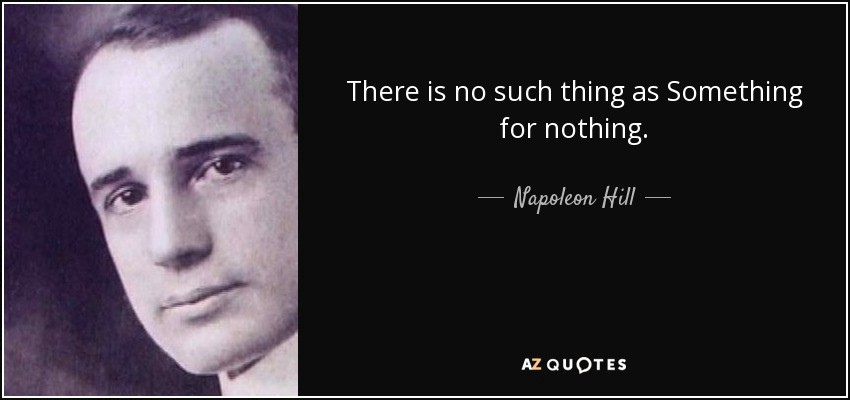

Everything that we built was based on free information and free resources that were found on the web and I think it is in our responsibility to give back. There are a lot of entrepreneurs who want to start a business or want to scale one, but they don’t know how to acquire new users without using a paid channel. We want to help these people so they can apply some of the techniques and spend less time doing experiments.

In this case study, I will present how we grew monthly revenue ~5x, from $17.000 to $106.000 while being in a very crowded market (Themes and Templates). Here is an overview of the article:

1.  Partnership strategies (The moment you quit is the moment you lose)
2.  If you want to be great, stay near great companies
3.  Growth Hacking: from trending on Github’s front page to continuous launches on Product Hunt
4.  How different we are from our competitors and why this worked for us
5.  Give Back: Education, Sponsorships, and Tutorials
6.  Can people apply our strategies to different businesses?
7.  What’s next?

#### Let’s begin! :-)

<Embed src="https://giphy.com/embed/rVbAzUUSUC6dO/twitter/iframe" aspectRatio={undefined} caption="Image from giphy: [https://giphy.com/gifs/chris-pratt-jimmy-kimmel-rVbAzUUSUC6dO](https://giphy.com/gifs/chris-pratt-jimmy-kimmel-rVbAzUUSUC6dO)" />

### 1\. Partnership strategies

If you’ve read the other article, you know that after some trial and error in different fields, from giving design components to our users and some growth hacking, we finally found the [Product Market Fit](https://en.wikipedia.org/wiki/Product/market_fit). We had around 226.000 visits made by 77.000 people, and we were grossing $22.000 from about 400 paying customers. While we continued to launch new products, we realized that there is a limited amount of money that those people can spend.

That means that if you have 10 premium products with an average value of $55 there will be 400 people who will buy. But if you push 10 more premium products those 400 people will still buy only 1 product as they need 1 product for their project, not 2 or 3. It’s the same thing as going to a supermarket with $10 to buy 1 bottle of milk, it doesn’t matter if the supermarket brings in 25 more types of milk, you will not spend $30 to buy 3 bottles of milk just because there is a lot of milk there.

It was painful for us to find this, as we were thinking like “ahh…the business it’s pretty simple, we launch more, we make more”. So the next thing that we had to do, while we were launching new products, was to find new partners that wanted to join us and help with the delivery of our free and paid products to a bigger audience.

> “Shoot for the moon. Even if you miss, you will land among the stars.”

We started to look for websites that had 3–10–20 or even 100x the traffic that we had. Since we based all our business on the most popular framework for front end, [Bootstrap](https://getbootstrap.com/), we started looking for all the websites that were related to Bootstrap. After a lot of emails and requests and rejection we though it was cool and crazy enough to try to do a partnership with the creators of Bootstrap. Most of the time people think like this: “There were a lot of people who ignored us, I will not ask them because they are too big and they will ignore us. It’s better to stay in my corner.”

So on 7 June 2017, we contacted the [creators of Bootstrap](https://github.com/orgs/twbs/people) and presented them with what we were doing, what we wanted to achieve with the Bootstrap Templates, and what was our mission.

We’ve got pretty shocked when we got their response. Why?

<Embed src="https://giphy.com/embed/3o6fJg42iSXpiWmcXm/twitter/iframe" aspectRatio={undefined} caption="" />

1.  It was a positive response saying that something would happen in the future and they would come back with some ideas.
2.  We were thrilled that they considered our business. There were basically thousands of other companies/people doing Bootstrap Templates.
3.  They actually came back. Usually, 99% of people will not respond to your proposals.

Later that year, they contacted us and told us that they would launch an official [Bootstrap Marketplace](https://themes.getbootstrap.com/) and they wanted to have us in the first batch of 5–7 companies.

The most important part here wasn’t the fact that we would start making more money and would deliver to more people with this partnership. It was the fact that we began to talk directly with the creators of Bootstrap and we got feedback about how we should improve and work on top of Bootstrap. That’s way more valuable than money and came as another validation for us, that we were providing high-quality products.

> “The creators of a framework are the most qualified to give you the best feedback about how you should work with their product.”

**Next partnership: WordPress.** During the years we knew that [WordPress is powering around 30%](https://venturebeat.com/2018/03/05/wordpress-now-powers-30-of-websites/) of all the websites around the world, but we never did anything on this side. We have in our target range developers and web agencies who know how to code. When you do something for WordPress you know that it is possible to have somebody who is not technical who will try to “1-Click install” your product and it will have problems. Then they’ll come to your support being angry about his experience.

Since we never did anything for WordPress but wanted to see our design on WordPress themes we were looking for a solid partner in this field. We found [ThemeIsle](https://themeisle.com/), the company who built one of the most the popular WordPress themes, [Zerif](https://wordpress.org/themes/zerif-lite/). They are from the same country as we are so we started to talk about ways of collaborating.

We realized that a great combo would be to migrate our most popular [UI Kit, Material Kit](https://www.creative-tim.com/product/material-kit), to WordPress. In this way, we created [Hestia](https://wordpress.org/themes/hestia/), a WordPress Theme that was using our design.

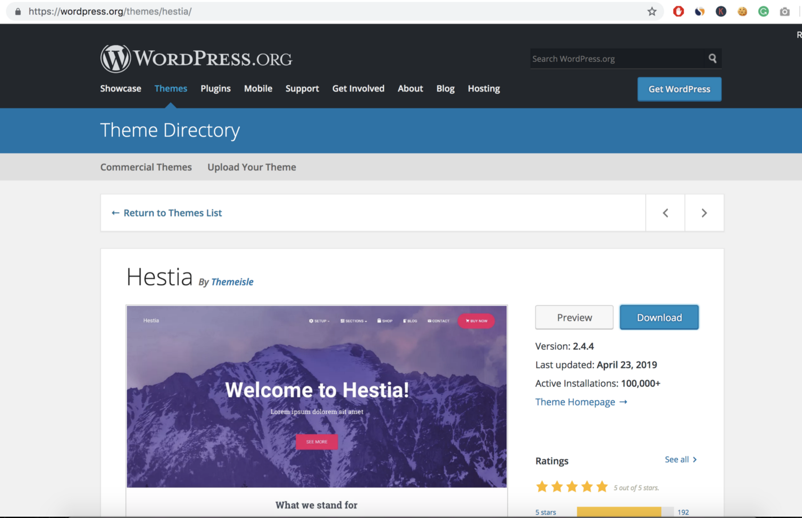

Hestia was a great success. It was downloaded hundred of thousands of times and currently it has 100,000+ active installs. More, it is in the [top 10 most popular](https://wordpress.org/themes/browse/popular/) WordPress themes of all time. We also made another product, [Orfeo](https://wordpress.org/themes/orfeo/), which was built on top of [Paper Kit 2](https://www.creative-tim.com/product/paper-kit-2) and is in the top 50 most popular themes for WordPress. Having this partner was really important for us as we entered a new world that we couldn’t do on our own.

The next partnership we created was something that we’ve been working on for around two years. Unfortunately, it’s an exclusive partnership, so we cannot give details about who is behind this. I will show you why it took us two years to build it. If you look at the first email that I sent you will notice some mistakes that I made:

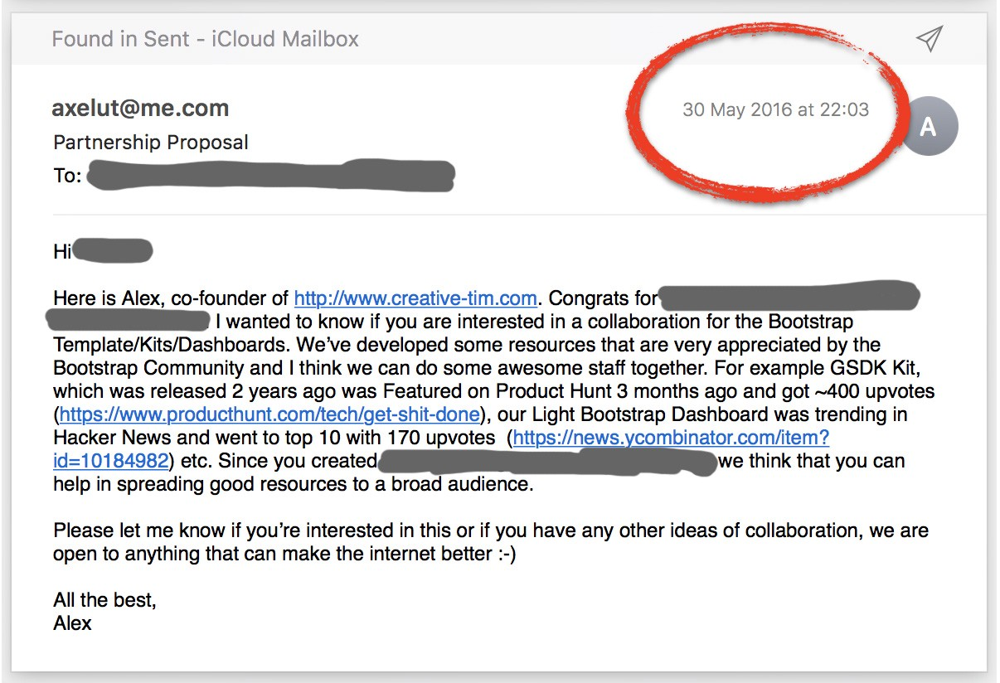

1.  I only talked about my company and me, and I never told him what he could achieve from this partnership (exposure, money, experience, etc.)
2.  I didn’t give any details, like “we expect to have 10.000 downloads from your source” or “we think your users will download 2x more products because of the high quality” etc.
3.  I didn’t tell anything about what we could do for him to help in his business

So it took me **26 emails over 21 months** to understand that I had to change my messages to give something to a possible partner before getting something from it. Sometimes you have to learn it the hard way. 🤷🏽‍♂️

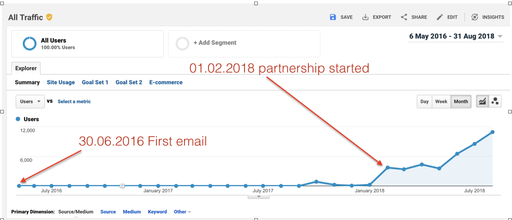

In the end, our partner was pleased with the new collaboration, and I’m feeling good that I continued to “spam him” and never gave up.

> “We learnt an important lesson here, that you have to give something before you get something!”

### 2\. If you want to be great, stay close to great companies

We always had the philosophy of learning and getting inspired by other more prominent companies that have tens of years of experience in a field. In the past, we’ve got inspiration from Apple, Rolls Royce, Heroku, Invision, Airbnb, Stripe, Dribbble, etc. I think that if you learn from these companies, you can create a rock-solid foundation. Then when you have all the skills and knowledge, you can start playing with them and create something new and unique, as Pablo Picasso said.

We wrote more about how we build a product and how is the strategy and implementation in this article: “[The Anatomy of a Bootstrap Dashboard](https://medium.freecodecamp.org/the-anatomy-of-a-bootstrap-dashboard-that-earns-1-000s-each-month-ed3404010d25).”

Looking for sources of inspiration and then following [InVision](https://medium.com/@InVisionApp) for many years, we decided to take inspiration from one of their most popular UI Kits called [Now UI](https://www.invisionapp.com/inside-design/design-resources/now/), which was launched in 2015 and was available only for designers. We wanted to use it as the core foundation for a new UI Kit made for developers.

We’ve got Invision’s approval, and we were allowed to build the coded version for developers on 8 November 2016. After 4–5 months of researching, planning based on Invision’s principles, and developing, we released the [HTML version based on Bootstrap](https://www.creative-tim.com/product/now-ui-kit).

The result and the way our developers received the new product was incredibly good. The design was great because Invision made it, and the code was very well structured and followed the Bootstrap 4 principles. That was a great combo in terms of Design + Code + Documentation. Later we found out that the success of this product was because we took **one of the best UI Kits that was available and made it better** by coming with the coded version and new elements/pages.

> “Take the best that exists and make it better.” — Henry Royce (co-founder of Rolls Royce)

### 3\. Growth Hacking: from continuous launches on Product Hunt to trending on Github’s front page or features in our country press

Since the initial boost for [creative-tim.com](https://www.creative-tim.com/) came from Product Hunt, we decided to continue to launch products there. The difference between launching in 2014–2015 and launching in 2018 was pretty big as the community grew a lot and there are a lot of new products launches daily. That makes it really hard to stand out of the crowd.

The strategy of launching on Product Hunt became really complicated, and we work for around one week before doing an actual post there. Everything needs to be set and a lot of people have to be involved. Some things that you have to think of:

1.  You need to prepare all the images, product descriptions, links, and social profiles before actually starting the post. That will save you a lot of time. Here we usually do a draft of the future post and then discuss internally with the whole team the text and images.
2.  You have to make sure your website will not break as there will be a boost in traffic. We usually send people to static generated content, so fewer server resources are needed.
3.  Try to post at the beginning of the Week (Monday) around 10:15 AM GMT+2, that is 00:15 AM San Francisco time, basically when the Product Hunt Servers start a new day. In this way, you make sure you have 24hours full exposure and get as many upvotes as you can.
4.  If you already have a base of people that are using your product, make sure you send them an email to let them know that you are on Product Hunt and if they enjoyed using the product they can upvote it.
5.  Make sure you let your social fans (Facebook, Twitter, Instagram) know that you are on Product Hunt.
6.  If you are posting a paid product, make sure you create some coupons that can be used by the Product Hunt community. They love them :D

Using these steps we successfully launched some products that were well received by the community:

-   [Material Dashboard Free ](https://www.producthunt.com/posts/material-dashboard)— 756 upvotes
-   [Now UI Kit](https://www.producthunt.com/posts/now-ui-kit) — 1.556 upvotes
-   [Material Dashboard All Technologies (Bootstrap, React, Vuejs, Angular)](https://www.producthunt.com/posts/material-dashboard-v2) — 505 upvotes

While we were looking for new ways of showing our products to a bigger audience, we found this article written by [Diana Neculai](https://medium.com/@diananeculai) from Froala: [How to get up to 3500+ GitHub stars in one week](https://medium.freecodecamp.org/how-to-get-up-to-3500-github-stars-in-one-week-339102b62a8f). It was pretty exciting, and we were thinking that if they did that, maybe we can also be trending on GitHub, as we already have open source products and the developer community loves them.

We followed all the steps that were written in the article and also applied the strategies that we used on Product Hunt. We prepared a friendly [Readme page for Material Dashboard](https://github.com/creativetimofficial/material-dashboard) and added all the technologies that were available for Material Dashboard (Bootstrap, React, Vuejs, Angular). We posted on social media and then sent a newsletter to 90.000 developers who were using Material Dashboard. After this initial boost, we were trending in All Languages for one day.

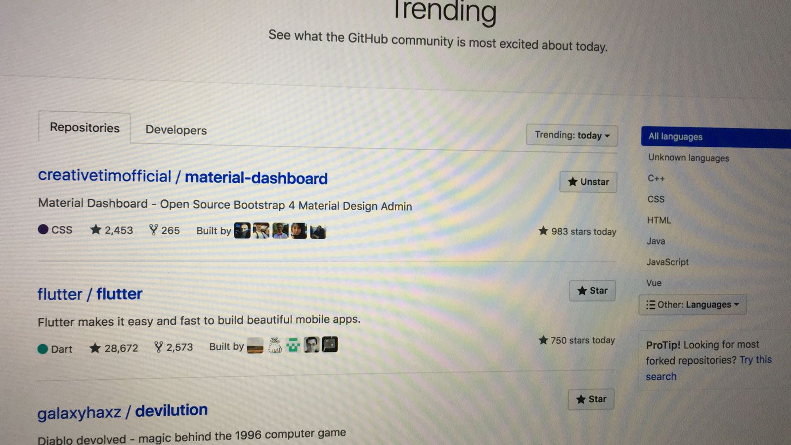

Since we boosted it to top 5 for a day, we started to announce to our audience that we are trending on Github, and that helped us get more people involved. We added a Banner on our website which was viewed by over 50,000 people, and then we posted that repo on Hacker News where the magic happened. It was featured on the first page, [upvoted by around 430 people](https://news.ycombinator.com/item?id=17373465), and 9,800 people came to the GitHub where they gave us around 2,000 stars.

So we were in front of Facebook, Google, and Microsoft for that week.

Launching on Product Hunt, Hacker News, or being on local Press is not a sustainable growth channel, as Product Hunt’s **founder Ryan said,** but it’s an excellent strategy to employ at the beginning of your business.

### 4\. How different we are from our competitors and why this worked for us

We are running our business in a very competitive space: themes & templates. Most of the entrepreneurs that I’ve met thought that this was a dead place and that we couldn’t create something relevant. We wanted to prove that things can be done in any space, no matter how crowded it is, if you have your secret weapon. If you read the first article, you know that our secret weapon is **to deliver great products combined with great user experience and great customer support**.

Let’s have a look at most of our competitors who sell their products in different marketplaces. Of course, there are some exceptions, as we are not unique in our field, but let’s have a look at 95% of the companies who create similar products with ours.

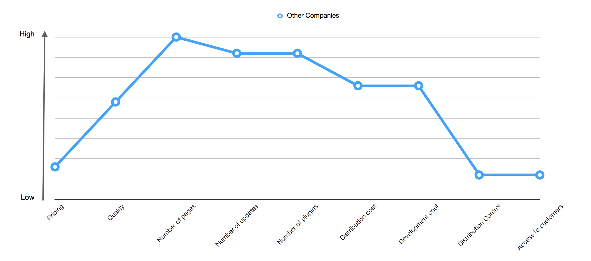

Now, let’s have a look at our curve and have a little overview of each point:

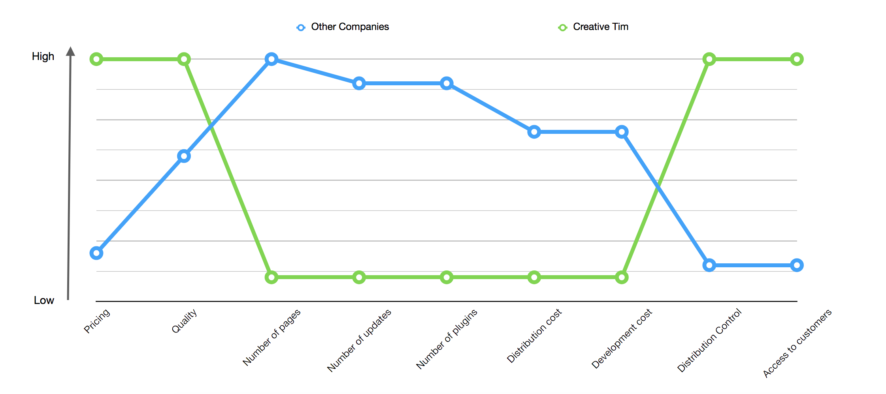

1.  **Pricing:** when we started our business we found that most HTML templates/themes/kits/dashboards were priced between $3 and $19, while Wordpress templates were priced between $49 and $69. Things changed during the years, and HTML templates started to cost more. We made some calculations, and we couldn’t sustain our business if we started in the same price range $3–$19. We also read in some business books that **if the price is your only differentiator, then you are in big trouble**. So we decided to charge more for our products so we could have the flexibility to build products that have top quality and customer experience.
2.  **Quality:** on a scale from low to high, most of our competitors deliver medium quality. This is because they invest most of their resources, which are a combination of money + time, into building more pages, more plugins and more updates for all those plugins and pages. These things combined with the pressure of releasing new products gives them less time to invest in the quality and the attention to details of their products.

3\. The number **of pages/examples**: if you look at all the marketplaces you will see that everybody is building products that have hundreds or thousands of pages. The problem here is that each product is coming with multiple examples of the same page that serve only one purpose. For instance, you will find products with five examples of a Contact Us page. Why should you create five good pages instead of building one that is great and simple for the client to use?

4. **The number of updates:** because the distribution is made on a platform that is not controlled by the creator, when you do an update, your product gets some more visibility. So people just do a lot of updates, no matter if the product needs one or not, only to appear in front of others. The problem here is that if you don’t have anything to update, you start to add more pages (**point 3**) or more plugins (**point 5**).

5\. The number **of plugins:** the same story can be seen in the external 3rd party plugins. For example, most of our competitors have, let’s say, 5–7 different JavaScript plugins that do the same thing. Your customer will use only 1, so it is hard for them to remove the other 4–6 to start building what they need.

6\. **Distribution costs:** since we are talking about companies selling products on popular marketplaces, they have to pay 30–55% of their revenue to the owners of the marketplace. This depends on the terms that each marketplace has. In our case, the distribution is made straight on [our website](https://www.creative-tim.com).

7\. **Development costs:** taking into consideration point 2, 3 and 5, we understand that these companies invest a lot in building their products. But the investment is made into quantity, not quality. In our case, we created some internal tools where we write code one time, and that is building more products based on the same design rules. In this way the hard part (writing the product code) is handled by the tools, while we spent most of the time in researching, testing new and different ideas, and giving a lot of attention to details.

If you still think that the attention to details is not so important, let’s have a look at some basic alignment on Samsung Galaxy S7 (top) and Apple iPhone 6S (bottom).

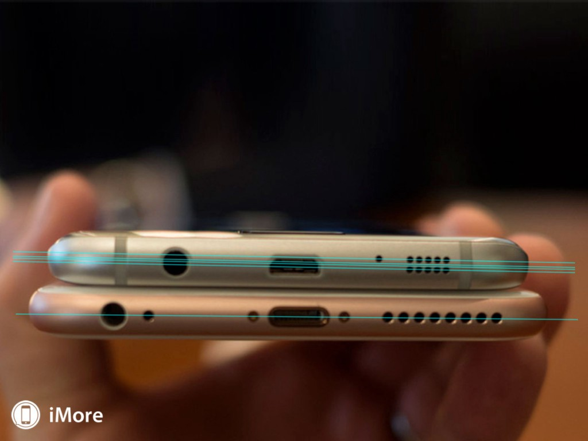

8\. **Distribution control:** since our competitors are selling their products on channels that they don’t control, basically they cannot do much, and they depend on the owner of the marketplace. If the owner decides to send less traffic to somebody or move the products away from the featured areas, you can’t change that. Or if we think at another case that happened with a popular marketplace a couple of weeks ago, the owner stopped paying the creators and didn’t respond for three months… What can you do in that situation?

In our case, we can do basically anything that is good for our users. Also during the years we changed and updated our platform hundreds of times based on our customers’ feedback.

9\. **Access to customers:** in our competitors’ examples, it’s hard to have direct access to the persons who purchased the products. In most of the cases, you get access to your customer only when they are contacting you for support requests. Because of this, they cannot do custom email campaigns; they cannot bundle their products; they cannot announce to all their customers when they launch something new, etc.

What we presented here is an overview of a Blue Ocean Strategy. If you want to learn more about the way you can create a new space for your business and not try to compete in a Red Ocean, please check the [Blue Ocean Strategy Book](https://www.amazon.com/Blue-Ocean-Strategy-Uncontested-Competition/dp/1591396190).

### 5\. Give Back: Sponsorships, Education and Tutorials

At [Creative Tim](https://www.creative-tim.com/presentation) we believe in the power of giving back! We are proud to sponsor schools, universities, hackathons and be part of events where we can teach people how to become better developers, designers, and entrepreneurs.

Over the years, we’ve used a lot of the Free and Open Source content made by other companies and developers, so it is our responsibility to give back. We used to sponsor with licenses of our paid products, and the feedback from the people who used the products at the events and from the organizers was excellent. Sponsoring is something good to do, even if it takes a lot of time for us to talk and to prepare everything for the participants. We also get customer support requests after each event.

**At this moment we have over 150 global events sponsored, and we add 5–10 each month.** If you host an event for developers, contact us at hello@creative-tim.com, and we will be more than happy to work with you.

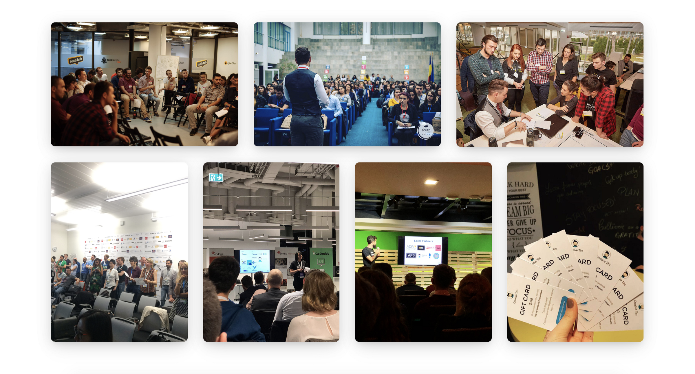

While we were at different events, we realized that we could only help a limited number of participants. So if we wanted to help millions we needed to do something online that would grow in parallel with our offline activities. So we started to make tutorials for different topics that were requested by our users. We decided that it was good to test written versions and also recorded videos. Some examples:

-   \[article\] [How to use ReactJS with WebPack Babel and Material Design](https://medium.freecodecamp.org/how-to-use-reactjs-with-webpack-4-babel-7-and-material-design-ff754586f618) — **3.9k claps**
-   \[article\] [How to use Redux in ReactJS with Real Life Examples ](https://medium.freecodecamp.org/how-to-use-redux-in-reactjs-with-real-life-examples-687ab4441b85)— **1k claps**
-   \[videos\] [Tutorials about front end development](https://www.youtube.com/channel/UCVyTG4sCw-rOvB9oHkzZD1w/videos) — **280k views**
-   \[casestudy\] [The anatomy of a Bootstrap Dashboard that earns $1,000seach month](https://medium.freecodecamp.org/the-anatomy-of-a-bootstrap-dashboard-that-earns-1-000s-each-month-ed3404010d25) — **14k claps**

We are also very proud that, through our affiliation, we managed to support a lot of creators for different frameworks and plugins that we used. For example, when this article was written, we contributed in the past 12 months $71,555 to the popular Material UI library.

](./asset-16.png)

### 6\. Can people apply our strategies to different businesses?

We believe that there is enough space for each company to create value, generate good profits, and also give back to the community, so we are not afraid of sharing all these strategies.

> “The secret to creativity is knowing how to hide your sources.” — Albert Einstein

Some people were inspired by [the first article that I wrote](https://medium.freecodecamp.org/growing-a-side-project-into-a-17-000-month-business-46024d2aa87f) and managed to create similar businesses in different environments. [William Candillon](https://medium.com/@wcandillon) is a great example. You can read the [full interview with him on Indie Hackers.](https://www.indiehackers.com/interview/how-transparency-and-good-timing-helped-me-capitalize-on-new-tech-d8032b8929)

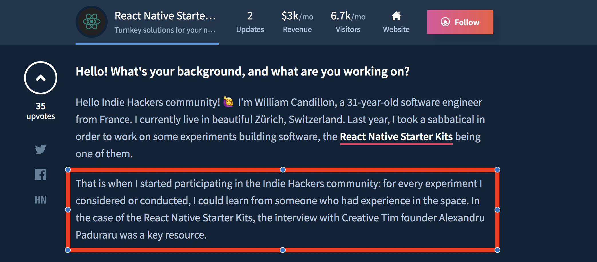

If you apply any of our strategies, feel free to share them with the community in the comments.

### 7\. What’s next?

In past years, we managed to become known in the Front End ecosystem for the quality that we deliver, and we are proud to see that we have over 700.000 developers who have used our products for different projects. We are still a tiny player in this game, and we have a lot of things to learn and improve. We always build all our products and start migrating on a new framework based on our customer requests.

1.  \[**Backend**\] Starting this year we are happy to let you know that we released the first batch of ready to be used [**Front End + Back End**](https://www.creative-tim.com/search?utf8=%E2%9C%93&q=backend&button=) solutions. It will now be easier for our customers and users to launch something. You can check the [Node.js](https://www.creative-tim.com/search?utf8=%E2%9C%93&q=node&button=) and [Laravel](https://www.creative-tim.com/search?utf8=%E2%9C%93&q=laravel&button=) examples on our website. We will release more Back End solutions based on the requests that we have.
2.  \[**Mobile**\] We also migrated one of our most popular products, [Material Kit](https://www.creative-tim.com/product/material-kit), to React Native, and so far [the reviews are excellent (4.9/5](https://www.creative-tim.com/product/material-kit-react-native/reviews)). You [can check it out and download it for free here](https://www.creative-tim.com/product/material-kit-react-native). This is something new for us, and we learned that building a Mobile First app is very different than building a Responsive Website. We will release React Native versions for all of our designs.
3.  \[**Illustrations**\]  We’ve seen a lot of people and companies starting to add illustrations on their websites so they can express better what they want to share. We also used illustrations in some of our products, so we decided to create more and give them for free to the community. This is how an internal project called [Ira Design](https://iradesign.io/) was born. We will continue to add more illustrations and customizations to this project.

Here is an overview of how the company has grown during the years. We usually net around 75% of that annual amount after paying affiliates, vendor fees, collected VAT, and other taxes for doing e-commerce between countries.

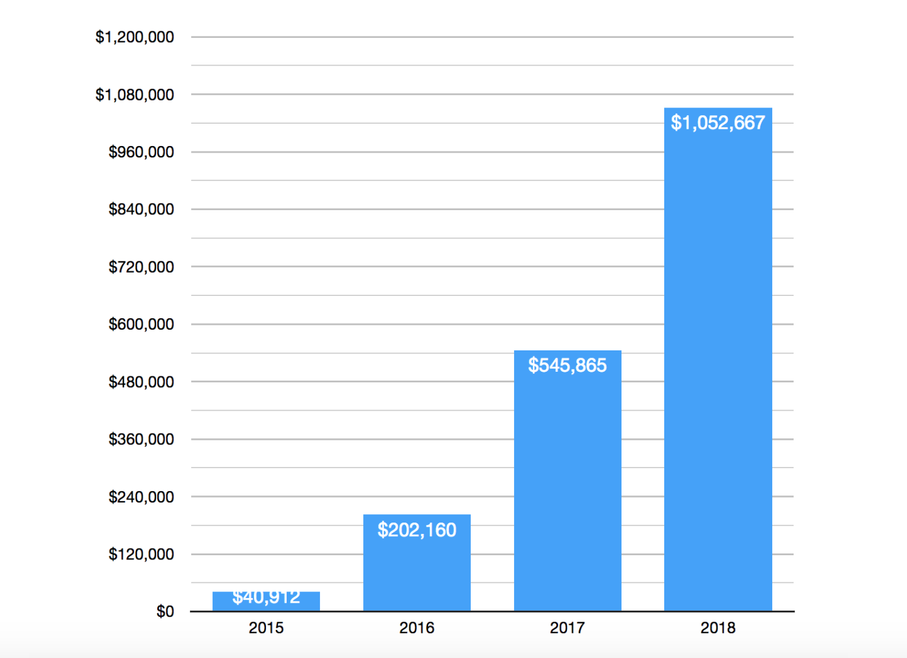

### Thank you for reading!

I hope this article has given you some ideas on how to test or apply new strategies in your business, or even to create a new one. Let’s continue the discussion in the comments and if you have questions, suggestions, or want to work with us, feel free to contact our team or me.

Find me and our team:

-   Email: [alex@creative-tim.com](mailto:alex@creative-tim.com)
-   Instagram: [https://www.instagram.com/alexandru\_\_paduraru/](https://www.instagram.com/alexandru__paduraru/)
-   Twitter: [https://twitter.com/axelut](https://twitter.com/axelut)
-   Official Website: [https://www.creative-tim.com](http://www.creative-tim.com/?utm_source=indie-hackers)
-   Our Github: [https://github.com/creativetimofficial](https://github.com/creativetimofficial)
